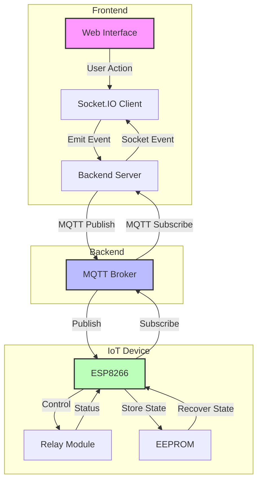

# Homato - Home Automation System

Homato is a complete home automation solution that allows you to control various household devices remotely through a web interface. The system uses MQTT for reliable communication between the control interface and IoT devices.

## Features

- **Real-time Control**: Toggle multiple home appliances and fixtures including:
  - Main Switch
  - Lights (Regular, Tube, Bed, False Ceiling)
  - Fans
  - Air Conditioner
  - Switch Ports

- **Connection Status Monitoring**: Real-time status indicators for both server and device connectivity
- **Activity Logging**: Track all control operations and status changes
- **State Persistence**: Device states are stored in EEPROM to recover after power outages
- **Mobile-Friendly Interface**: Responsive design that works on all device sizes

## System Architecture

### Components

1. **Web Control Interface**:
   - Node.js backend with Express
   - Socket.IO for real-time communication
   - Clean, responsive UI for device control

2. **Firmware**:
   - ESP8266-based hardware implementation
   - Secure MQTT client for cloud communication
   - State persistence via EEPROM

3. **MQTT Broker**:
   - Secure cloud-based message broker (HiveMQ)
   - Topic-based publish/subscribe pattern
   - Supports device status monitoring

## Setup and Installation

### Prerequisites

- Node.js v14+
- Docker (for containerized deployment)
- ESP8266 compatible board for hardware

### Backend Setup

1. Clone the repository:
   ```
   git clone https://github.com/yourusername/homato.git
   cd homato
   ```

2. Install dependencies:
   ```
   cd homato-control-system
   npm install
   ```

3. Run the application:
   ```
   npm start
   ```

   Or use Docker:
   ```
   sudo docker build -t app .
   sudo docker run -d -it -p 3000:3000 --name appc app
   ```

### Firmware Setup

1. Open the Arduino IDE
2. Install ESP8266 board support
3. Open `Firmware/homato_v1/homato_v1.ino`
4. Update WiFi and MQTT credentials
5. Upload to your ESP8266 device

## Hardware Setup

Connect relays to these GPIO pins:
- Main Switch: D1
- Light: D2
- Additional pins can be configured for other devices

## Usage

1. Access the web interface at `http://localhost:3000`
2. Use the toggle switches to control your devices
3. Monitor connection status at the top of the interface
4. View activity logs at the bottom of the page

## Security Considerations

- The system uses secure MQTT communication (mqtts)
- For production use, replace `setInsecure()` with proper certificate validation
- Update default credentials before deployment

## License

[MIT License](LICENSE)

## Contributing

Contributions are welcome! Please feel free to submit a Pull Request.

## Acknowledgements

- This project uses HiveMQ as the MQTT broker
- Built with Node.js, Express, and Socket.IO
- ESP8266 community for the excellent IoT libraries 


## Logic Flow



### Data Flow Description

1. **User Interaction**
   - User toggles a device in the web interface
   - Socket.IO client emits control event to backend

2. **Backend Processing**
   - Server receives Socket.IO event
   - Processes request and publishes to MQTT topic
   - Maintains connection status and device states

3. **MQTT Communication**
   - Broker handles message routing between backend and IoT device
   - Manages retained messages and QoS levels
   - Handles device availability status

4. **IoT Device Operation**
   - ESP8266 receives MQTT messages
   - Controls appropriate relay
   - Stores state in EEPROM
   - Reports status back through MQTT
   - Handles power recovery and state restoration

5. **Status Updates**
   - Device publishes state changes
   - Backend subscribes and updates clients
   - Web interface reflects current state
   - Activity log updated

### Error Handling

- Connection loss detection
- Automatic reconnection attempts
- State persistence during power outages
- Command throttling to prevent relay damage
- Device availability monitoring
