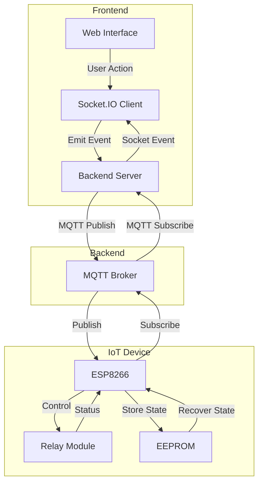

# Homato Documentation

Welcome to the Homato documentation! This documentation provides comprehensive information about the Homato Home Automation System.

## Quick Navigation

- [Getting Started](getting-started.md)
- [Installation Guide](installation.md)
- [Hardware Setup](hardware.md)
- [Configuration](configuration.md)
- [Troubleshooting](troubleshooting.md)
- [API Documentation](api.md)
- [Contributing Guide](../CONTRIBUTING.md)
- [FAQ](faq.md)

## What is Homato?

Homato is an open-source home automation solution that enables you to control various household devices through a web interface. Built with ESP8266, Node.js, and MQTT, it provides real-time control, state persistence, and a mobile-friendly UI.

## System Overview

## Key Features

- Real-time device control
- Connection status monitoring
- Activity logging
- State persistence
- Mobile-friendly interface
- Secure MQTT communication 