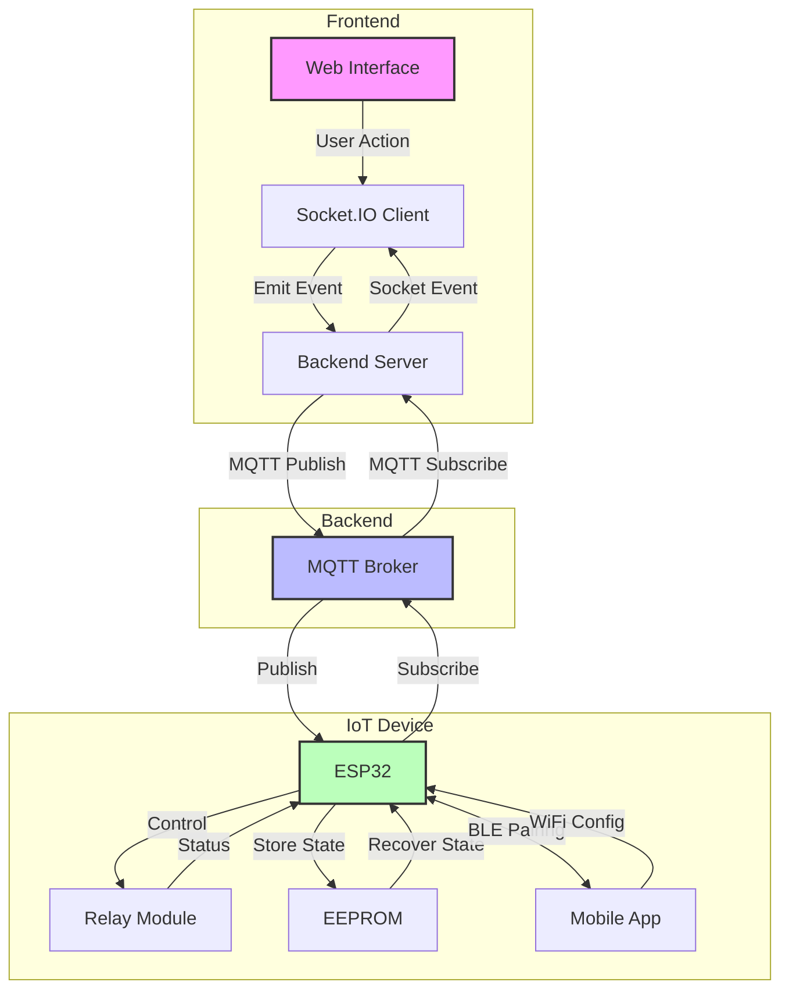

# Homato System Overview

Homato is a complete home automation solution that allows you to control various household devices remotely through a web interface. The system uses MQTT for reliable communication between the control interface and IoT devices, with added Bluetooth connectivity for easy setup and configuration.

## System Architecture

### Components

1. **Web Control Interface**:
   - Node.js backend with Express
   - Socket.IO for real-time communication
   - Responsive UI for device control on all screen sizes
   - Mobile app for device setup and control

2. **Firmware**:
   - ESP32-based hardware implementation
   - BLE support for device pairing and configuration
   - Secure MQTT client for cloud communication
   - Multi-network support with fallback capability
   - State persistence via EEPROM

3. **MQTT Broker**:
   - Secure cloud-based message broker (HiveMQ)
   - Topic-based publish/subscribe pattern
   - Support for QoS levels and retained messages
   - Handles device availability status

## Key Features

- **Real-time Control**: Toggle multiple home appliances and fixtures including:
  - Main Switch
  - Lights (Regular, Tube, Bed, False Ceiling)
  - Fans
  - Air Conditioner
  - Switch Ports

- **Bluetooth Configuration**: Easy device setup and WiFi configuration via BLE
  - Long-press button activation (5 seconds)
  - Automatic device discovery
  - Secure credential transmission
  - Setup feedback and verification

- **Multiple Network Support**: Store up to 3 WiFi credentials for improved reliability
  - Automatic fallback to alternative networks
  - Prioritized connection attempts
  - Persistent credential storage

- **Connection Status Monitoring**: Real-time status indicators for both server and device connectivity
  - Online/offline status indicators
  - Connection quality monitoring
  - Automatic reconnection attempts

- **Activity Logging**: Track all control operations and status changes
  - Timestamped event logging
  - User action recording
  - Device state change history

- **State Persistence**: Device states are stored in EEPROM to recover after power outages
  - Immediate state saving
  - Boot-time state recovery
  - State verification

## Data Flow

## Process Flow

1. **Device Onboarding**
   - User presses the BLE button on the device for 5 seconds to activate pairing mode
   - Mobile app discovers and connects to the device via BLE
   - Device provides information about its capabilities (relay count, device ID)
   - User configures WiFi credentials through the mobile app
   - Device stores multiple WiFi credentials in EEPROM for fallback

2. **User Interaction**
   - User toggles a device in the web interface
   - Socket.IO client emits control event to backend

3. **Backend Processing**
   - Server receives Socket.IO event
   - Processes request and publishes to MQTT topic
   - Maintains connection status and device states

4. **MQTT Communication**
   - Broker handles message routing between backend and IoT device
   - Manages retained messages and QoS levels
   - Handles device availability status

5. **IoT Device Operation**
   - ESP32 receives MQTT messages
   - Controls appropriate relay
   - Stores state in EEPROM
   - Reports status back through MQTT
   - Handles power recovery and state restoration
   - Automatically tries alternative WiFi networks if primary connection fails

## Security Considerations

- Secure MQTT communication over TLS
- Proper certificate validation for production environments
- BLE pairing security measures
- Password encryption in storage
- Input validation and sanitization

## Next Steps

- See [Installation Guide](installation.md) for setup instructions
- Review [Hardware Setup](hardware.md) for physical components
- Check [BLE Pairing](ble-pairing.md) for device configuration details
